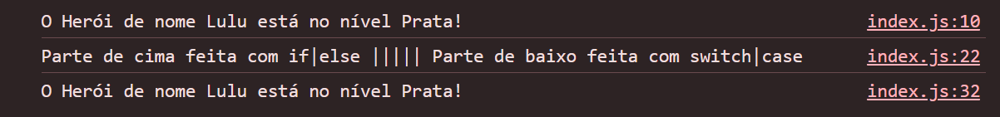
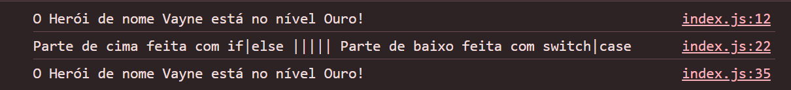
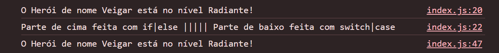

# 🦸🏽‍♂️ Desafio Nível do Herói

Um projeto que permite visualizar e calcular o nível de um herói em uma escala específica, utilizando JavaScript puro. Totalmente disponibiliado pela DIO. Um grande abraço ao Felipão, professor de JavaScript da DIO!

## 🛠️ Tecnologias Utilizadas

- **JavaScript**: para toda a lógica de cálculo e atualização da escala.

## 📝 Aprendizados 

- Variáveis
- Operadores
- Laços de repetição
- Estruturas de decisões

## 🚀 Funcionalidades

- **Cálculo de Nível**: calcula o nível atual do herói com base nos pontos ou experiência.

## 🖼️ Imagem do Projeto Funcionando

## 🔗 Link para ter acesso ao projeto

[Clique aqui!!](https://gabrielgomesdev20.github.io/Desafio-Nivel-Heroi---Dio/)

